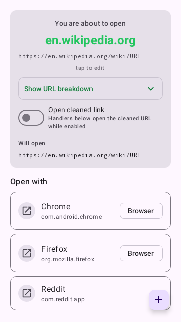
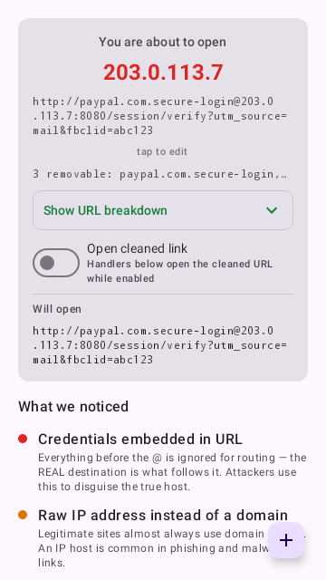
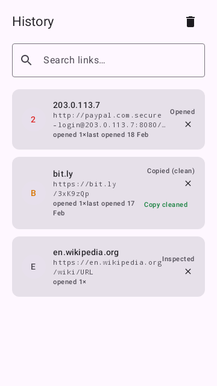
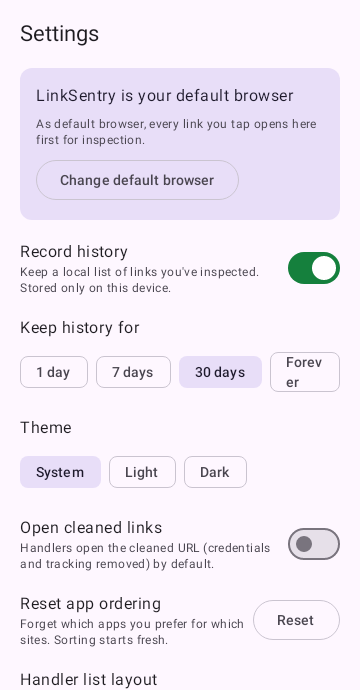

# LinkSentry

A default-browser replacement that **never renders web content**. Every link
you tap lands in LinkSentry first: see exactly where it points, what's
suspicious about it, and choose which app — if any — gets to open it.

## Why

Tapping a link hands control to whatever is on the other end. LinkSentry puts
a checkpoint between the tap and the load: the URL is decomposed and checked
**entirely on your device**, and nothing is fetched until you explicitly pick
an app to open it with.

**The app declares zero permissions — not even `INTERNET`.** It contains no
WebView, no HTTP client. It is *physically incapable* of loading a link,
leaking a URL, or phoning home. This is enforced in CI.

## Features

- **Default-browser interception** — set LinkSentry as your browser; every
  http/https tap opens the Inspect screen instead of a page.
- **URL risk signals (local, no cloud):** embedded credentials
  (`http://google.com@evil.com`), IP-literal hosts, non-standard ports,
  punycode/homograph hosts, URL shorteners, tracking parameters
  (`utm_*`, `fbclid`, …), dangerous schemes (`javascript:`, `data:`, `intent:`,
  `file:`), and more. Absence of signals is never presented as "safe".
- **Open-with chooser** — the real list of installed apps that can handle the
  link, browsers flagged; launches use explicit intents only.
- **Copy / Copy cleaned / Share** — cleaned strips credentials + tracking
  parameters.
- **Manual inspect** — paste or type any URL.
- **Local history** (Room, on-device only) with retention control.
- **No network. No analytics. No tracking. Zero permissions.**

## Screenshots

| Inspect (clean link) | Dangerous link (gated) |
|---|---|
|  |  |

| History | Settings |
|---|---|
|  |  |

*Rendered from Roborazzi Compose previews — the same snapshots CI verifies.*

## Install

Grab the latest signed APK from [Releases]. Dev builds install side-by-side
(`…debug` app id suffix, amber icon).

## Build

```bash
JAVA_HOME=<jdk17> ./gradlew clean spotlessApply spotlessCheck lintDebug assembleDebug --no-daemon --no-configuration-cache
```

JDK 17 required. See [docs/technical-spec.md](docs/technical-spec.md).

MIT License.

[Releases]: ../../releases
